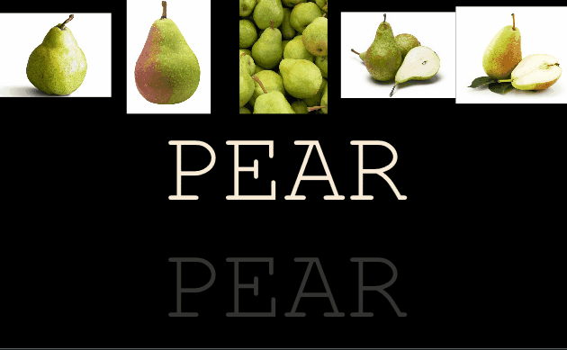
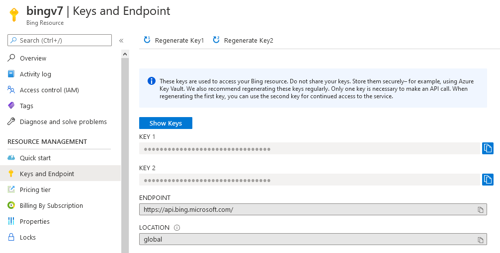
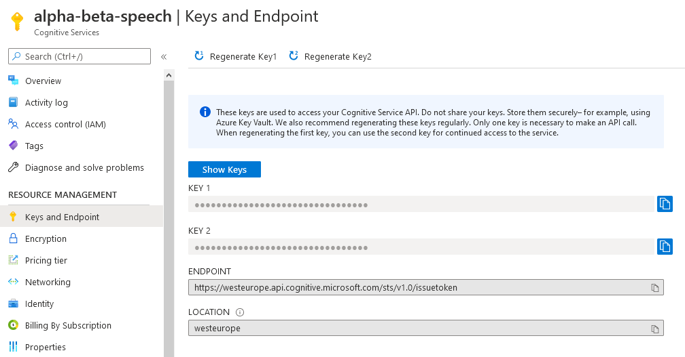

# alpha-beta
A simple learning game, which uses Azure cognitive services, that I've made for my children. It picks a random word from a list of words for the user to type. It uses `Bing Search` for searching related images and `Text to Speech` for reading the word out loud.

# Prerequisites
- Visual Studio 2015 or later
- Active Azure Subscription with `Bing Search v7` and `Bing Speech` resources created.

# Build
- Open `alpha-beta.sln` in Visual Studio.
- Modify `alpha-beta\App.config` and add your cognitive services API keys.
  - Add `Bing Search v7` key to `searchApiKey`
  
  - Add `Bing Speech` key to `speechApiKey`
  
  - Alternatively modify language by modifying `locale`. Supported locales can be found [here](https://docs.microsoft.com/en-us/azure/cognitive-services/Speech/api-reference-rest/bingvoiceoutput#SupLocales)
- Build

# Add/remove words used
- Open up `words.txt` and add/remove words. Each word is separated by newline.

